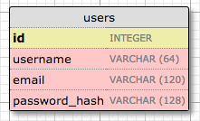
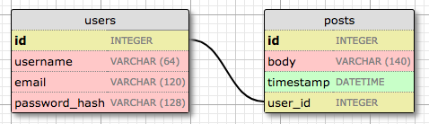
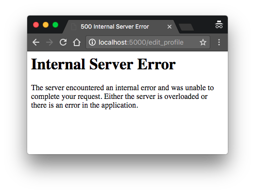
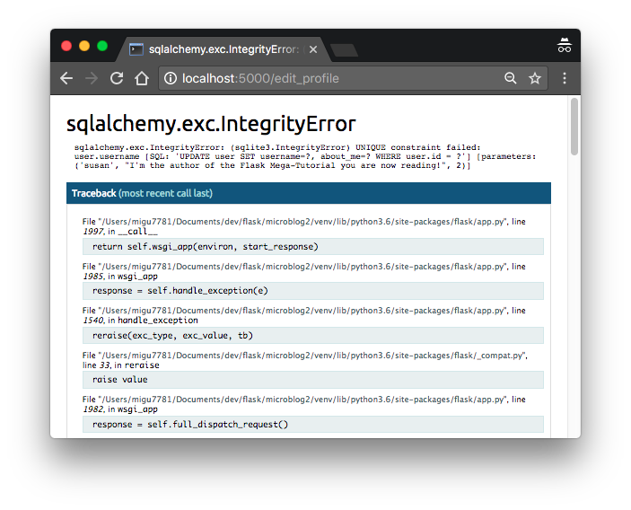

# Flask

## ¡Hola, mundo!
```sh
mkdir microblog && cd microblog
python3 -m venv venv
source venv/bin/activate
```
Intalación de Flask

    pip install flask

Comprobar la instalación de Flask

    import flask

Crear un paquete `app` para albergar la aplicación:

    mkdir app

`app/__init__.py`: el script crear el objeto de la aplicación como una instancia de la clase
`Flask` importado del paquete flask. La variable `__name__` pasada a la clase `Flask` es una
variable predefinida de Python, que se establece en el nombre del módulo en el que se utiliza.
Flask usa la ubicación del módulo pasado aquí como punto de partida cuando necesita cargar
recursos asociados, como archivos de plantilla. A todos los efectos practicos, pasando
`__name__` casi siempre va a configurar Flask de la manera correcta. A continuación, la
aplicación importa el módulo `routes`, que aún no existe.

Otra peculiaridad es que el módulo `routes` se importa en la parte inferior y no en la parte
superior del script como siempre se hace. La importación inferior es una solución para las
importaciones circulares, un problema común con las aplicaciones de Flask. Vas a ver que
el módulo `routes` necesita importar la variable `app` definida en este script, por lo que
colocar una de las importaciones en la parte superior evita el error que resulta de las
referencias mutuas entre dos archivos.

Entonces, ¿qué pasa en el módulo `routes`? Las rutas son las diferentes URLs que implementa la
aplicación. En Flask, los controladores para las rutas de la aplicación se escriben como
funciones de python, denominadas *funciones de visualización*. Las funciones de vista se
asignan a una o más URls de ruta para que Flask sepa qué lógica ejecutar cuando un cliente
solicita una URL determinada.

`app/routes.py`: es la primera función de vista para esta aplicación.

Esta función de vista es bastante simple, solo devuelve un saludo como una cadena.
`@app.route` las dos líneas extrañas de arriba de la función son decoradores, una
característica única de Python. Los decoradores modifican la función que le sigue. Un
patrón común con los decoradores es usarlos para registrar funciones como devoluciones de
llamada para ciertos eventos. En este caso, el decorador `@app.routes` crea una
asociación entre la URL dada como argumento y la función. En este ejemplo hay dos decoradores
, que asocian las URL `/` e `/index` a esta función. Esto significa que cuando el navegador
solicite cualquiera de las dos URL, Flask invocará esta función y devolverá el valor
devuelto al navegador como respuesta.

Para completa la aplicación, debe tener una secuenia de comandos de Python en el nivel
superior que defina la instancia de la aplicación Flask. `microblog.py`: con una sola línea
que importa la instancia de la aplicación.

La instancia de la aplicación Flask se llama `app` y es miembro del paquete `app`. La
declaración `from app import app` importa la variable `app` que es miembro del paquete `app`.

Se debe indicar a Flask cómo importarlo, configurando la variable ambiental:

    export FLASK_APP=microblog.py

Para ejecutarlo:

    flask run --host=0.0.0.0

`localhost:5000/` y `localhost:5000/index`: La primera URL se asigna a `/`, mientras que el
segundo corresponde a `/index`. Ambas rutas están asociadas con una única función de vista
en la aplicación, por lo que producen el mismo resultado, que es la cadena que devuelve
la función. Si ingresa cualquier otra URL, obtendrá un error, ya que la aplicación
solo reconoce estas dos URL.

Dado que las variable no se recuerdan en las sesiones de terminal, puede que resulte
tedioso tener que configurar siempre la variable de entorno `FLASK_APP` en cada
nueva terminal. A partir de la versión `1.0`, Flask le permite registrar las variables
de entorno que desea que se importen automáticamente cuando ejecute el dominio `flask`.
Para usar esta opción, debe instalar el módulo `python-dotenv`:

    pip install python-dotenv

Luego, puede escribir el nombre y el valor de la variable de entorno en un archivo
llamado `.flaskenv` ubicado en el directorio de nivel superior del proyecto.

## Templates
#### ¿Qué son las plantillas?
Quiero que la página de inicio de mi aplicación tenga un encabezado que de la bienvenida
al usuario. Por el momento voy a ingorar el hecho de que la aplicación aún no tiene
el concepto de usuarios (más adelante). En su lugar, usaré un usuario simulado, que
implementaré como un diccionario de Python, de la siguiente manera:
```py
user = {'username': 'Miguel'}
```
La creación de objetos simulados es una técnica útil que le permite concentrarse en
una parte de la aplicación sin tener que preocuparse por otras partes del sistema que
aún no existe.

La función de vista en la aplicación devuelve una cadena simple. Lo que quiero hacer
ahora es expandir esa cadena devuelta en una página HTML completa, tal vez algo
como esto -> `app/routes.py`.

Las plantillas ayudan a logar esta separación entre la presentación y la lógica
comercial. En Flask, las plantillas se escriben como archivos separados, almancenados
en una carpeta de plantillas que se encuentra dentro del paquete de la aplicación.
Entonces, cree el directorio donde se almacenarán las plantillas:

    mkdir app/templates

`app/templates/index.html`

Esta es una página HTML en su mayoría estándar, muy simple. Lo único interesante de
esta página es que hay un par de marcadores de posición para el contenido dinámico,
encerrados en secciones `{{ .. }}`. Estos marcadores de posición representan las
partes de la página que son variable y solo se conocerán en tiempo de ejecución.

Ahora que la presentación de la página se descargó en la plantila HTML, la función
de vista se puede simplificar -> `app/routes.py`.

La operación que convierte una plantilla es una página HTML completa se denomina
representación. Para renderizar la plantilla, tuve que importar una función que viene
con Flask llamada `render_template()`. Esta función toma un nombre de archivo de plantilla
y una lista variable de argumentos de plantilla y devuelve la misma plantilla, pero
con todos los marcadores de posición reemplazado por valores reales.

La función `render_template()` invoca el motor de plantillas Jinga2 que viene incluido
con Flask. Jinga2 sustituyo `{{ .. }}` con los valores correspondientes, dado por los
argumentos proporcionados al llamar a `render_template()`.

#### Declaraciones condicionales
Ha visto cómo Jinga2 reemplaza los marcadores de posición con valores reales durante
el renderizado, pero esta es solo una de las muchas operaciones poderosas que admite
Jinga2 en los archivos de plantilla. Por ejemplo, las plantillas también adminte
sentencias de control, dadas dentro de bloques ``. Agregar una declaración
condicional -> `app/templates/index.html`.

Ahora la plantilla es un poco más inteligente. Si la función de vista se olvida de pasar
un valor para la variable `title` de marcador de posición, en lugar de mostrar un título
vacío, la plantilla proporcionará uno predeterinado. Puede probar cómo funciona esta
condicional eliminando el argumento `title` en la llamada de la función 
`render_template()`. Aplica para el título en la pestaña del navegador.

#### Bucles
El usuario conectado probablemente querrá ver las publicaciones recientes de los
usuarios conectados en la página de inicio.

Crear algunos usuarios falsos en `/app/routes.py`.

Para representar las publicaciones de los usuarios, estoy usando una lista, donde cada
elemento es un diccionario que tiene los campos `author` y `body`.

Por el lado de la plantilla tengo que resolver un nuevo problema. La lista de
publicaciones puede tener cualquier cantidad de elementos, depende de la función de
vista decidir cuántas publicaciones se presentarán en la página. La plantilla no puede
hacer supociones sobre cuántas publicaciones hay, por lo que debe estar preparada
para representar tantas publicaciones como la vista envíe de forma genérica.

Para este tipo de problemas, Jinga2 ofrece una estructura de control `for`
-> `app/templates/index.html`.

#### Herencia de plantillas
La mayoría de las aplicaciones web en estos días tienen una barra de navegación en la
parte superior de la página con algunos enlaces de uso frecuente, como un enlace para
editar un su perfil, iniciar sesión, cerrar, sesión, etc. Puede agregar fácilmente
una barra de navegación a la plantilla `index.html` con algo más de HTML, pero a medida
que la aplicación crezca, necesitará esta misma barra de navegación en otras páginas.

Jinga2 tiene una función de herencia de plantillas. En escencia, lo que puede hacer es
mover las partes del diseño de página que son comunes a todas las plantillas a una
plnatilla base, de la cual se derivan todas las demás plantillas.

Definir una plantilla base llamada `base.html` que incluya una barra de navegación simple
y también la lógica de título implemantado anteriormente. Plantilla base en
`app/templates/base.html`.

`block` declaración de control para definir el lugar donde las plantillas derivadas
pueden insertarse. Los bloques reciben un nombre único, al que las plantillas derivadas
pueden hacer referencia cuando proporcionan su contenido.

Con la plantilla base en su lugar, ahora puede simplificar `index.html` haciéndolo
heredar de `base.html`. Modificar `app/templates/index.html`.

Dado que la plantilla `base.html` ahora se encargará de la estructura general de la
página, quite todos los elementos de `index.html` y dejé solo la parte del contenido.
La declaración `extends` establece el vínculo de herencia entre las dos plantillas,
de modo que Jinga2 sabe que cuando se le pide que renderice `index.html` necesita
incrustarlo dentro de `base.html`. Las dos plantillas tienen la declaración
`block` con nombre `content`, así es como Jinga2 sabe combinar las dos plantillas en
una sola. Ahora, si necesita crear páginas adicionaes para la aplicación, puede
crearlas como plantillas derivadas de la misma plantilla `base.html`, y así es como
puede hacer que todas las páginas de la aplicación compartan la misma apariencia sin
duplicación.

## Web forms
#### Introducción a Flask-WTF
Para manejar los formularios web en esta aplicación, voy a usar la extensión Flask-WTF,
que es un envoltorio delgado alrededor del paquete WTForms que se integra muy bien
con Flask.

Las extensiones de Flask son módulos regulares de Python que se instalar con `pip`.

    pip install flask-wtf

Hay varios formatos para que la aplicación especifique las operaciones de configuración.
La solución más básica es definir sus variables como claves en `app.conf`, que
utiliza un estilo de diccionario para trabajar con variables.

Para mantener las cosas bien organizadas, voy a crear una clase de configuración
en un módulo de Python separado. A continuación puede ver la nueva clase de
configuración para esta aplicación, almacenada en un módulo `config.py` en el directorio
de nivel superior: `config.py`.

La variable `SECRET_KEY` de configuración que agregué como el único elemento de
configuración es una parte importante en la mayoría de las aplicaciones Flask.
Flask y algunas de sus extensiones utilizan el valor de la clave secreta como clave
criptográfica, útil para generar firmas y token. La extensión Flask-WTF lo usa para
proteger formularios web contra un ataque desagradable llamado Cross-Site Request
Forgery o CSRF. Como su nombre lo indica, se supone que la clave secreta es secreta,
ya que ninguna persona fuera de los mantenedores de confianza de la aplicación lo
sepan.

El valor de la clave secreta se establece como una expresión con dos términos,
unidos por el operador `or`. El primer término busca el valor de una variable de
entorno llamada `SECRET_KEY`. El segundo término es solo una cadena codificada.
Este es un patrón que se podra repetir para las variables de configuración. La
idea es que se prefiera un valor procedente de una variable de entorno, pero si
el entorno no define la variable, entonces se utiliza la cadena codificada de
forma predeterminada. Cuando está desarrollando esta aplicación, los requisitos de
seguiridad son bajos, por lo que puede ignorar esta configuración y dejar que se use
la cadena codificada, configuraré un valor único y difícil de adivinar en el entorno,
de modo que el servidor tenga una clave segura que nadie más conozca.

Ahora que tengo un archivo de configuración, necesito decirle a Flask que lo lea y
lo aplique. Eso se puede hacer justo después de crear la instancia de la aplicación
Flask usando el método `app.config.from_objet()`: `app/__init__.py`.

Se puede acceder a los elementos de configuración con una sintaxis de diccionario
desde `app.config`:
```py
from microblog import app
app.config['SECRET_KEY']
```
Una vez más, teniendo en cuenta la separación de preocupaciones, voy a usar un nuevo
módulo `app/forms.py` para almacenar mis clases de formularios web. Para comenzar,
definamos un formulario de inicio de sesión de usuario, que le pide al usuario que
ingrese un nombre de usuario y una contraseña. El formulario también incluirá una
casilla de verificación "recordarme" y un botón de envío: `app/forms.py`.

La mayoría de las extensiones de Flask usan una convención de nomeclatura `flask_<name>`
para su símbolo de importación de nivel superior. En este caso, Flask-WTF
tiene todos sus símbolos bajo `flask_wtf`. Aquí es donde la clase base `FlaskForm` se
importa desde la parte superior de `app/forms.py`.

Las cuatro clases que representan los tipos de campo que estoy usando para este
formulario se importan directamente del paquete WTForms, ya que la extenisón
Flask-WTF no proporciona versiones personalizadas. Para cada campo, se crea un
objeto como una variable de clase en la clase `LoginForm`. Cada campo recibe una
descripción o etiqueta como primer argumento.

El argumento `validators` que ve en algunos de los campos se usa para adjuntar
comportamientos de validación a los campos. El validador `DataRequired` simplemente
verifica que el campo no se envíe vacío. Hay muchos más validadores disponibles.

#### Plantillas de formulario
El siguiente paso es agregar el formulario a una plantilla HTML para que se pueda
representar en una página web. La buena noticia es que los campos que están
definidos en la clase `LoginForm` saben cómo representarse a sí mismos como HTML,
por lo que esta tarea es bastante simple. A continuación puede ver la plantilla de
inicio de sesión, se almacenará en `app/templates/login.html`.

Para esta plantilla se está reautilizando la plantilla `base.html`, a través de la
declaración `extends` de herencia de plantilla.

Esta plantilla espera un objeto de formulario instanciado desde la clase `LoginForm`
que se dará como un argumento, que puede ver referenciado como `form`. Este
argumento será enviado por la función de vista de inicio de sesión, que aún no
se ha escrito.

El elemento HTML `<form>` se utiliza como contenedor para el formulario web. El
atributo `action` del formulario se usa para decirle al navegador la URL que debe usarse
al enviar la información que el usuario ingresó en el formulario. Cuando la
acción se establece en una cadena vacía, el formulario se envía a la URL que se
encuentra actualmente en la barra de direcciones, que es la URL que represento el
formulario de la página. El atributo `method` especifica el método de solicitud HTTP
que debe usarse al enviar el formulario al servidor. El valor predeterminado es
enviarlo como una solicitud `GET`, pero en casi todos los casos, utilizando una
solicitud `POST` mejora la experiencia del usuario porque las solicitudes de este
tipo pueden enviar los datos del formulario en el cuerpo de la solicitud, mientras
que `GET` agregar los campos de los formularios en la URL, saturando la barra de
direcciones del navegador. El atributo `novalidate` se usa para decirle al navegador
que web que no que no aplique la validación a los campos de este formulario, lo
que deja esta tarea a la aplicación Flask que se ejecuta en el servidor. Usando
`novalidate` es completamente opcional, pero para este primer formulario es
importane que lo establezca porque le permitirá probar la validación del lado del
servidor.

El argumento `form.hidden_tag()` de plantilla genera un campo oculto que incluye
un token que se usa para proteger el formulario contra ataques CSFR. Todo lo que
necesita hacer para proteger el formulario es incluir este campo oculto y tener
el `SECRET_KEY` definida en la configuración de Flask. Si te encargas de estas dos
cosas, Flask-WTF hace el resto por ti.

Si ha escrito formularios web HTML en el pasado, es posible que le haya resultado
extraño que no haya campo HTML en la plantilla. Esto se debe a que los campos del
objeto de formulario saben cómo monstrarse como HTML. Todo lo que tenía que hacer
era incluir `{{ form.<field_name>.label }}` donde quería la etiqueta de campo, y
`{{ form.<field_name()> }}` donde quería el campo. Para los campos que requieren
atributos HTML adicionales, se puede pasar como argumentos. Los campos de usuario
y contrseña en esta plantilla `size` como un argumento que se añadirá al elemento
HTML `<input>` como atributo. Así es como también pueden adjuntar clases CSS o Id
a campos de formulario.

#### Vista de formulario
El paso final antes de que pueda ver este formulario en el navegador es codificar
una nueva función de vista en la aplicación que repesente la plantilla de la
sección anterior.

Nueva función de vista asignada a la URL de inicio de sesión que crea un formulario
y lo pasa a la plantilla para su procesamiento. Esta función de visualización
también puede ir en el módulo `app/routes.py`.

Lo que hice aquí es importar la clase `LoginForm` de `forms.py`, creó una instancia de
un objeto y lo envío a la plantilla. `form=form` la sintaxis puede parecer extraña,
pero simplemente está pasando el objeto `form` creado en la línea de arriba a la
plantilla con el nombre `form`.

Para facilitar el acceso al formulario de inicio de sesión, la plantilla base
puede incluir un enlace en la barra de navegación: `app/templates/base.html`.

En este punto, puede ejecutar la aplicación y ver el formulario en su navegador.
Con la aplicación en ejecución, escriba `localhost:/5000/` en la barra de direcciones
y luego haga clic en Inicar sesión para ver el nuevo formulario.

#### Recepción de datos de formulario
Si intenta presionar el botón Enviar, el navegador monstrará un error de "Método
no permitido". Esto se debe a que la función de vista de inicio de sesión de la
sección anterior hace la mitad del trabajo hasta ahora. Puede mostrar el formulario
en una página web, pero aún no tiene la lógia para procesar los datos enviados por
el usuario. Esta es otra área en la que Flask-WTF hace que el trabajo sea realmente
fácil. Aquí hay una versión actualizada de la función de vista que acepta y valida
los datos enviados por el usuario -> `app/routes.py`.

la primera novedad de esta versión es el argumento `methods` en el decoradore de rutas.
Esto le dice a Flask que esta función de vista acepta solicitudes `GET` y `POST`,
anulando el valor predeterminado, que es solo aceptar peticiones `GET`. El protocolo
HTTP que las peticiones `GET` son aquellas que devuelven información al cliente.
Todas las solicitudes en la aplicación hasta el momento son de este tipo. Las
solicitudes `POST` se utilizan normalmente cuando el navegador envía datos de formulario
al servidor. El error "Metodo no permitido" que el navegador mostró antes,
aparece porque el navegador intentó enviar una solicitud `POST` y la aplicación
no estaba configurada para aceptarla. El proporcionar el argumento `methods`, le
está diciendo a Flask qué métodos de solicitud debe aceptar.

El método `form.validate_on_submit()` hace todo el trabajo de procesamiento de
formularios. Cuando el navegador envía la solicitud `GET` para recibir la página web
con el formulario, este método va a devolver `False`, por lo que en ese caso la
función omite la instrucción `if` y va directamente a representar la plantilla en
la última línea de la función.

Cuando el navegador envía la solicitud `POST` como resultado de que el usuario
presione el botón enviar, `form.validate_on_submit()` va a recopilar todos los datos,
ejecutará todas las validaciones adjuntos a los campos y, si todo está bien,
retornará `True`, indicando que los datos son válidos y pueden ser tratados por la
aplicación. Pero si al menos un campo falla en la validación, la función devolverá
`False`, y eso hará que el formulario se devuelva al usuario, como en el caso de la
solicitud `GET`.

Cuando `form.validate_on_submit()` devuelve `True`, la función de vista de inicio de
sesión llama a dos funciones nuevas, importadas de Flask. La función `flash()` es
una forma útil de monstrar un mensaje al usuario. Muchas aplicaciones utilizan esta
técnica para informar al usuario se alguna acción ha tenido éxito o no. En este
caso, voy a usar este mecanismo como una solución temporal, por ahora monstrara un
mensaje que confirme que la aplicación recibió las credenciales.

`redirect()` esta función le indica al navegador web del cliente que vaya
automáticamente a una página diferentes, pasada como argumento. Esta función de
visualización la utiliza para redirigir al usuario a la página de `index` de la
aplicación.

Cuando llamas a la función `flash()`, Flask almacena el mensaje, pero los mensajes
flasheados no aparecerán mágicamente en las páginas web. Las plantillas de la
aplicación deben representar estos mensaje flasheados de una manera que funcione
para el diseño del sitio. Voy a agregar estos mensajes a la plantilla base, para que
todas las plantillas hereden esta funcionalidad -> `app/templates/base.html`.

Aquí estoy usando un constructor `with` para asignar el resultado de llamar a 
`get_flashed_messages()` a una variable `messages`, todo en el contexto de la
plantilla. La función `get_flashed_messages()` proviene de Flask y devuelve una lista
de todos los mensajes que se han registrado previamente con `flash()`. La condición
comprueba si `messages` tiene algún contendo. y en ese caso, un elemento `<lu>`
representara cada mensaje como un elemento de la lista `<li>`.

Una propiedad interesante de estos mensajes flasheados es que una vez que se
solicitan una vez a través de la función `get_flashed_messages()` se eliminan de
la lista de mensajes, por lo que aparecen solo una vez después de llamar a la
función `flash()`.

#### Mejorar la validación de campos
Los validadores que se adjuntar a los campos del formulario evitan que se acepten
datos no válidos en la aplicación. La forma en que la aplicación trata con la
entrada del formulario no váliada es volviendo a mostrar el formulario, para
permitir que el usuario haga las corecciones necesarias.

Si intentó enviar datps no válidos, estoy seguro de que notó que, si bien los
macanismo de validación funcionan bien. no hay ninguna indicación para el usuario
de que algo anda mal con el formulario, el usuario simplemente recupera el
formulario. La siguiente tarea es mejorar la experiencia del usuario agragando un
mensaje de error significativo junto a cada campo que falló en la validación.

De hecho, los validadores de formularios ya generan estos mensajes de error
descriptivo, por lo que todo lo que falta es alguna lógica adicional en la
plantilla para representarlos.

Plantilla de inicio de sesión con mensajes de validación de campo agregados en los
campos de nombre de usuario y contraseña -> `app/templates/login.html`.

El único cambio que he hecho es agregar bucles `for` justo después de los campos de
nombre de usuario y contraseña que representan los mensajes de error agregados
por los validadores de color rojo. Como regla general, cualquier campo que tenga
validadores adjuntos tendrá mensajes de error que resulten de la validación
agregada en `form.<field_name>.errors`. Esta va a ser una lista, porque los campos
pueden tener varios validadores adjuntos y más de uno puede proporcionar mensajes
de error para mostrar al usuario.

Si intenta enviar el formulario con un nombre de usuario y contrsela vacíos,
recibirá un mensaje de error en rojo.

#### Generando enlaces
El formulario de inicio de sesión está bastante completo ahora, pero antes de cerrar
este capítulo quería discutir la forma correcta de incluir enlaces en plantillas
y redireccionamiento.

Un problema con la escritura de enlaces directamente en plantillas y archivos
fuente es que si un día decide reorganizar sus enlaces, tendrá que buscar y
reemplazar estos enlaces en toda su aplicación.

Para tener un mejor control sobre estos enlaces, Flask proporciona una función
llamada `url_for()`, que genera direcciones URL usando un mapeo interno de direcciones
URL para ver funciones. Por ejemplo, la expresión `url_for('login')` devolverá
`/login` y `url_for('index')` devolverá `/index`. El argumento `url_for()` es el nombre
del punto final, que es el nombre de la función de vista.

Puede preguntar por qué es mejor usar los nombres de las funciones en lugar de las
URL. El hecho es que es mucho más probale que cambien las URL que ver los nombres
de las funciones, que son completamente internos. Una razón secundaria es que,
como aprenderá más adelante, algunas URL tienen componentes dinámicos, por lo que
generar esas URL a mano requeriría concaterna varios elementos, lo cual es tedioso
y propenso a errores. El `url_for()` también puede generar estas URL complejas.

Así que de ahora en adelante, voy a usar `url_for()` cada vez que necesite generar
una URL de aplicación -> `app/templates/base.html` y actualizar la función
`login()` -> `app/routes.py`.

## Databases
Flask no admite bases de datos de forma nativa. Pero tiene la libartad de elegir la
base de datos que mejor se adapte a su aplicación en lugar de verse obligado a
adaptarse a una.

Hay excelentes opciones para bases de datos en Python, muchas de ellas con
extensiones de Flask que hacen una mejor integración con la aplicación. Las bases
de datos se pueden separar en dos grandes grupos, las que siguen el modelo
relaciona y las que no. El último modelo a menuso se denomina NoSQL, lo que indica
que no implementa el popular lenguaje de consultas SQL. Si bien existen
excelentes productos de bases de daots en ambos grupos, las bases de dato
relacionales son una mejor combinación para las aplicaciones que tiene datos
estructurados, como listas de usuarios, pubicaciones de blog, etc., mientras que
las bases de datos NoSQL tienden a ser mejores para los datos que tienen una
estructura menos definida. Esta aplicación, como la mayoría de las demás, se puede
implementar utilizando cualquier tipo de base de datos.

Flask-SQLAlchemy es una extensión que proporciona un contenedor compatible con Flask
para el popular paquete SQLAlchemy, que es un mapaeador relacional de objetos u ORM.
Los ORM permiten que las aplicaciones administren una base de datos utilizando
entidades de alto nivel como clases, objetos y métodos en lugar de tablas y SQL.
El trabajo del ORM es traducir las operaciones de alto nivel en comandos de base de
datos.

Lo bueno de SQLAlchemy es que es un ORM no para una, sino para muchas base de
datos relaciones. SQLAlchemy admite una larga lista de motores de base de datos,
inlcuidos los populares MySQL, PostgreSQL y SQLite. Esto es extremadamente
poderoso, porque puede hacer su desarrollo utilizando una base da datos SQLite
simple que no requiere un servidor. y luego, cuando llegue el momento de
implementar la aplicación de un servidor de producción, puede elegir un servidor
MySQL o PostgreSQL más robusto, sin tener que cambiar su aplicación.

Instalar SQLAlchemy:

    pip install flask-sqlalchemy

#### Migraciones de bases de datos
Esto es difícil porque las bases de datos relacionales se centran en datos
estructurados, por lo que cuando la estructura cambia, los datos que ya están en
la base de datos deben migrarse para la estructura modificada.

Flask-Migrate es un contenedor de Flask para Alembic, un marco de migración de
base de datos para SQLAlchemy. TRabajar con Migraciones de base de datos agrega
un poco de trabajo para iniciar una base de datos, pero es un pequeño precio a
pagar por una form sólida de realiza cambios en su base de datos en el futuro.

Instalar Flask-Migrate:

    pip install flask-migrate

#### Configuración de Flask-SQLAlchemy
Las bases de datos SQLite son la opción más conveniente para el desarrollar
aplicaiones pequeñas, a veces incluso no tan pequeñas, ya que cada base de datos
se almacena en un solo archivo en el disco y no es necesario ejecutar un servidor
de base de datos.

Agregar dos nuevos elementos de configuración al archivo -> `config.py`.

La extensión Flask-SQLAlchemy toma la ubicación de la base de datos de la
aplicación de la variable `SQLALCHEMY_DATABASE_URI`. En este caso, estoy tomando
la URL de la base de datos de la variable de entorno `DATABSE_URL`, y si no está
definido, estoy configurando una base de datos llamada `app.db` ubicada en el
directorio principal de la aplicación, que se almacena en la variable `basedir`.

La opción de configuración `SQLALCHEMY_TRACK_MODIFICATIONS` está establecida en
`False` para deshabilitar una función de Flask-SQLAlchemy que no necesito, que es
enviar una señal a la aplicación cada vez que se va a relizar un cambio en la
base de datos.

La base de datos va estar representada en la aplicación por la instancia de la
base de datos. El motor de migración de base de datos también tendrá una
instancia. Estos son objetos que deben crearse después de la aplicación,
en el archivo -> `app/__init__.py`.

He realizado tres cambios en el script de `app/__init__.py`. Primero, he añadido
un objeto `db` que representa la base de datos. Luego he agregado otro objeto que
representa el motor de migración. Con surte, verá un patrón sobre como trabajar
con las extensiones de Flask. La mayoría de las extensiones se inicializan como
estas dos. Finalmente, Estoy importando un nuevo módulo llamado `models` en el
fondo. Este módulo definirá la estructura de la base de datos.

#### Modelos de base de datos
Los datos que se almacenarán en la base de datos estarán representado por una
colección de clases, generalmente denominadas *modelos de base de datos*. La capa
ORM dentro de SQLAlchemy hará las traducciones necesarias para asignar objetos
creados a partir de estas clases en filas en las tablas de base de datos
adecuadas.

Comencemos por crear un modelo que represente a los usuarios:



El campo `id` suele estar en todos los modelos y se utiliza como clave principal.
A cada usuario de la base de dato se le asignará un valor de identifiación único,
almacenado en este campo. Las claves primarias, en la mayoría de los casos, son
asignadas automáticamente por la base de datos, por lo que solo necesito
proporcionar el campo `id` marcado como clave primaria.

Los campos `username`, `email` y `password_hash` se definen como cadenas (`VARCHAR`), y
sus longitudes máximas se especifican para que la base de datos pueda optimizar
el uso del espacio. Mientras que los campos `username` y `email` se explican por sí
mismos, el campo `password_hash` merece algo de atención. Quiero asegurame de
que la aplicación que estoy creando adopte las mejores prácticas de seguridad y,
por ese motivo, no almacenaré las contraseñas de los usuarios en la base de datos.
El problema con el almacenamiento de contraseñas es que si la base de datos
alguna vez se ve comprometida, los atacantes tendrán acceso a las contraseña y
eso podría ser devastador para los usuarios. En lugar de escribir las contraseñas
directamente, voy a escribir un hash de contraseña, lo que mejora enormemente la
seguirdad.

Entonces, ahora que sé lo que quiero para mi tabla de usuarios, puedo traducirlo en
código en el nuevo módulo -> `app/models.py`.

La clase `User` hereda de `db.Model`, una clase base para todos los modelos de
Flask.SQLAlchemy. Esta clase define varios campos como variable de clase. Los
campos se crean como instancias de la clase `db.Column`, que toma como argumento
el tipo de campo, más otros campos opcionales que, por ejemplo, permiten indeicar
qué campos son únicos e indexados, lo cual es importante para que las búsquedas
en la base de datos sea eficiente.

El método `__repr__` le dice a Python cómo imprimir objetos de la clase, lo que sera
útil para la depuración, ejemplo:
```py
from app.models import User
u = User(username='susan', email='susan@example.com')
u
```

#### Creación del repositorio de migración
La clase de modelo creado en la sección anterior define la estructura de la base
de datos inicial (*schema*) para esta aplicación. Pero a medida que la aplicación
continúa creciendo, es probable que deba realizar cambios en esa estructura,
como agregar cosas nuevas y, a veces, modificar o eiminar elementos. Alembic
realizará estos cambios de esquema de una manera que no requiera que la base de
datos se vuelva a crear desde cero cada vez que se deba realizar un cambio.

Para logar esta tarea aparentemente fácil, Alembic mantiene un repositorio de
migración, que es un directorio en el que almacena sus scripts de migración. Cada
vez que se reliza un cambio en el esquema de la base de datos, se agrega un script
de migración al repositorio con los detalles de los cambios. Para aplicar las
migraciones a una base de datos, estos scripts de migración se ejecutan en la
secuencia en que se crearon.

Flask-Migrate expone sus comandos a través del dominio `flask`. `flask db` Flask-Migrate
agrega un subcomando para administrar todo lo relacioando con las migraciones de
base de datos. Crear el repositorio de migración para microblog:

    flask db init

Después de ejecutar este comando, encontrará un nuevo directorio de migraciones,
con algunos archivos y un subdirectorio de versiones dentro. Todos estos archivos
deben tratarse como parte de su proyecto a partir de ahora y, en particular, deben
agregarse al control de código de fuente junto con el código de la aplicación.

#### La primera migración de base de datos
Con el repositorio de migración en su lugar, es hora de crear la primera migración
de base de datos, que incluirá la tabla de usuarios que se asigna al modelo
`User` de la base de datos. Hay dos formas de crear una migración de base de datos:
manual o automáticamente. Para generar una migración automáticamente, Alembic
compara el esquema de la base de datos definido por los modelos de la base de datos
real que se usa actualmente en la base de datos. Luego, completa el script de
migración con los cambios necesarios para que el esquema de la base de datos
coincida con los modelos de la aplicación. En este caso, dado que no existe una
base de datos anterior, la migración automática agregará todo el modelo `User`
al script de migración. El subcomando `flask db migrate` genera estas migraciones
automáticas:

    flask db migrate -m "users table"

La salida del comando le da una idea de lo que Alembic incluyó en la migración. Las
dos primeras líneas son informativas y, por lo general, se pueden ignorar. Luego
dice que ecnotró una tabla de usuarios y dos índices. Luego te dice dónde escribió
el script de migración. El código `e517276bb1c2` es un código único generado
automáticamente para la migración. El comentario dado con la opción `-m` es opcional,
agrega un breve texto descriptivo a la migración.

El script de migración generado ahora es parte de su proyecto y debe incorporase
al control de código. La función `upgrade()` aplica la migración y la función
`downgrade()`. Esto le permite a Alembic migrar la base de datos a cualquier punto
del historial, incluso a versiones anteriores, utilizando la ruta de degreadación.

El coamndo `flask db migrate` no reliza ningún cambio en la base de datos, solo genera
el script de migración. Para aplicar los cambios a la base de datos, debe usar el
comando `flask db upgrade`:

    flask db upgrade

Debido a que esta aplicación una SQLite, el comando `upgrade` detectará que una base
de datos no existe y la creará (`app.db`). Cuando trabaje con sevidores de base de
datos, como MySQL y PostgreSQL, debe crear la base de datos en el servidor
antes de ejecutar `upgrade`.

Tenga en cuenta que Flask-SQLAlchemy usa una convención de nomeclatura "snake case"
para las tablas de la base de datos de forma predeterminada. Para el modelo
anterior `User`, la tabla correspondiente en la base de datos se llamará `user`.
Para la clase de modelo `AdreesAndPhone`, la tabla se llamaría `address_and_phone`.
Si prefiere elegir sus propios nombre de tablas, puede agregar un atributo llamado
`__tablename__` a la clase de modelo, establezca el nombre desea como una cadena.

#### Flujo de trabajo de actualización y degradación de la base de datos
La aplicación está en su infancia en este momento. Imagine que tiene su aplicación
en su máquina de desarrollo y también tiene una copia implementada en su servidor
de producción que está en línea y en uso.

Digamos que para la próxima versión de su aplicación debe introducir un cambio
en sus modelos, por ejemplo, se debe agregar una nueva tabla. Sin migraciones,
necesitaría descrubir cómo cambiar el esquema de su base de datos, tanto en su
máquina de desarrollo como en su servidor, y esto podría ser mucho trabajo.

Pero con el soporte de migración de base de datos, después de modificar los
modelos en su aplicación, genera un nuevo script de migración (`flask db migrate`),
probablemente lo revise para asegurarse de que la generación automática hizo lo
correcto y luego aplique los cambios a su base de datos de desarrollo
(`flask db upgrade`). Agregará el script de migración al control de código de
fuente y lo confirmará.

Cuando esté listo para lanzar la nueva versión de la aplicación a su servidor de
producción, todo lo que necesita hacer es obtener la versión actualizada de au
aplicación, que incluirá el nuevo script de migración y ejecutar `flask db upgrade`.
Alembic, detectará que la base de datos de producción no está actualizada a la
última revisión del esquema y ejecutará todos los nuevos scripts de la migración
que se crearon después de la versión anterior.

También tiene un comando `flask db downgrade`, que deshace la última migración. Si
bien es poco probable que necesite esta opción en su sistema de producción, puede
resultare muy útil durante el desarrollo. Es posible que haya generado un script
de migración y lo haya aplicado, solo para descubrir que los cambios que
realizó no son exactamente lo que necesita. En este caso, puede degradar la base
de datos, eliminar el script de migración y luego generar uno nuevo para
reemplazarlo.

#### Las bases de datos
Las bases de datos relacionales son buenas para almacenar relaciones entre
elementos de datos. Considere el caso de un usuario que escribe una publicación
de blog. El usuario tendrá un registro de la tabla `users`, y la publicación
tendrá un registro en la tabla `posts`. La forma más eficiente de registrar quién
escribió una publicación determinada es vincular los dos registros relacionados.

Una vez que establece un vinculo entre un usuario y una publicación, la base de
datos puede responder consultas sobre este vínculo. El más trivial es cuando
tienes una publicación de un blog y necesitar saber qué usuario lo escribió.
Una consulta más compleja es la inversa de esta. Si tiene un usuario, es posible
que desee concer todas las publicaciones que este usuario escribió. Flask-SQLAlchemy
ayudará con ambos tipos de consultas.

Expandamos la base de datos para almacenar publicaciones de blog y ver las
relaciones en acción. Esquema para una nueva tabla `posts`:



La tabla `posts` tendrá el `id` requerido, un campo `body` y un `timestamp`. Pero además
de estos campos separados, tendrá un campo `user_id`, que vincula la publicación
con su autor. Todos los usuarios tienen una clave `id` princila que es única. La
forma de vincular una publicación de blog con el usuario que lo creó es agregar
una referencia al `id`, eso es exactamente lo que el campo `user_id` es. Este campo
`user_id` se llava clave foránea. El diagrama de las bases de datos anterior
muestra las claves foráneas como un enlace entre el campo y el campo `id` de la
tabla que se refiere. Este tipo de ralación se llama uno a muchos, porque "un"
usuario escribe muchas "publicaciones". Modificar -> `app/models.py`.

La nueva clase `Post` representará publicaciones de blog escritas por usuarios. El
campo `timestamp` se indexará, lo cual es útil si desea recuperar publicaciones en
order cronológico. También he añadido un argumento `default`, y pasó la función
`datetime.utcnow`. Cuando pasa una función como predeterminada, SQLAlchemy
establecerá el campo en el valor al llamar a esa función. En general querrá
trabajar con fechas y horas UTC en una aplicación de servidor. Esto garantiza que
está utilizando marcas de tiempo uniforme independientemente de dónde se encuentren
los usuarios. Estas marcas de timpo se convertirán a la hora local del usuario
cuando se muestren.

El campo `user_id` se inicializó como una clave externa para `user.id`, lo que
significa que hace referencia a un valor `id` de la tabla de usuarios. En esta
referencia el campo `user` es el nombre de la tabla de la base de datos para el
modelo. Es una desafortunada inconsistencia que en algunos casos, como en una
llamada a `db.relationship()`, el modelo es referenciado por la clase del model, que
normalmente comienza con un carácter en mayúscula, mienstras que en otros casos
como esta declaración `db.ForeignKey()`, un modelo viene dado por su nombre de tabla
de base de datos, para el cual SQLAlchemy usa automáticamente caracteres en minúsculas
y, para nombres de modelos de varias palabras, mayúscula y minúsculas.

La clase `User` tiene un nuevo campo `posts`, que se inicializa con `db.relationship`.
Este no es un campo de base de datos real, sino una bista de alto nivel de la
relación entre usuarios y las publicaciones, y por esa razón no está en el
diagrama de la base de datos. Para una relación de uno a muchos `db.relationship`.
El campo normalmente se define en el lado "uno" y se usa como una forma
conveniente de obtener acceso a los "muchos". Entonces, por ejemplo, si tengo
tengo un usuario almacenado en `u`, la expresión `u.posts` ejecutará una consulta
de base de datos que devuelve todas la publicaciones escritar por ese usuario. El
primer argumento `db.relationship` es la clase modelo que representa el lado "varios"
de la relación. Este argumento se puede proporcionar como una cadena con el nombre
de la clase si el modelo se define más adelante en el módulo. El argumento
`backref` define el nombre de un campo que se agregará a los objetos de la clase
"varios" que apunta al objeto "uno". Esto agregará una expresión `post.author` que
devolverá al usuario una publicación dada. El agumento `lazy` define cómo se emitirá
la consulta de la base de datos para la relación.

Dado que tengo actualizaciones de los modelos de la aplicación, es necesario
generar una nueva migración de la base de datos:

    flask db migrate -m "posts table"

Y aplicar la migración a la base de datos:

    flask db upgrade

#### Jugando con la base de datos
Dado que la aplicación aún no tiene ninguna lógica de base de datos, juguemos con
la base de datos en el intérprete de Python para familiarizarnos con ella.
```py
from app import app, db
from app.models import User, Post
```
Para que Flask y sus extensiones tengan acceso a la aplicación Flask sin tener que
que pasar `app` como argumento en cada función, un contexto de aplicación se debe
crear y enviar.
```py
app.app_context().push()
```
A continuación, cree un nuevo usuario:
```py
u = User(username='john', email='john@example.com')
db.session.add(u)
db.session.commit()
```
Los cambios en una base de datos se realizan en el contexto de una sesión de base
de datos, a la que se puede acceder como `db.session`. Se pueden acumular múltiples
cambios en una sesión y una vez registrados todos los cambios se puede emitir un
solo `db.session.commit()`, que escribe todos los cambios. Si en cualquier momento
mientras se trabaja en una sesión hay un error, una llamada a `db.session.rollback()`
cancelará la sesión y eliminará los cambios almacenado en ella. Lo importante a
recordar es que los cambios solo se escriben en la base de datos cuando se emite
una confirmación con `db.session.commit()`. Las sesiones garantizan que la base de
datos nunca quedará en un estado inconsistente.

El contexto de la aplicación que se envió anteriormente permite que Flask-SQLAlchemy
acceda a la instancia de la aplicación Flask `app` sin tener que recibirlo como un
argumento. La extensión busca en el diccionario `app.config` la entrada
`SQLALCHEMY_DATABASE_URI`, que contiene la URL de la base de datos.

Agregar otro usuario:
```py
u = User(username='susan', email='susan@example.com')
db.session.add(u)
db.session.commit()
```
La base de datos puede responder una consulta que devuelve todos los usuarios:
```py
users = User.query.all()
users
...
for u in users:
    print(u.id, u.username)
```
Todos los modelos tienen un atributo `query` que es el punto de entrada para ejecutar
consultas de base de datos. la consulta más básica es aquella que devuelve todos los
elementos de esa clase, que se denomina `all()`. Tenga en cuenta que los campos `id`
se establecieron automáticamente en `1` y `2` cuando se agregaron los usuarios.

Aquí hay otra forma de hacer consultas. Si conoces el `id` de un usuario, puede
recuperarse ese usuario usando lo siguiente:
```py
u = User.query.get(1)
# or
print(User.query.get(1))
```
Ahora agregar una publicación de blog:
```py
u = User.query.get(1)
p = Post(body='test post', author=u)
db.session.add(p)
db.session.commit()
```
No necesita establecer un valor para `timestamp` porque ese campo tiene un valor
predeterminado, que puede ver en la definición del modelo. ¿Y qué paso con el campo
`user_id`? Recuerda el `db.relationship` que creé en la clase `User` agregando un
atributo `posts` a los usuarios, y también un atributo `author` a las publicaciones.
Asigno un autor a una publicación usando el campo virtual `author` en lugar de tener
que lidiar con el ID de usuario. SQLAlchemy es excelente en ese sentido, ya que
proporciona una abstracción de alto nivel sobre las relaciones y las claves externas.

Algunas consultas a la base de datos:
```py
u = user.query.get(1)
u
...
posts = u.posts.all()
posts
...

# usuario sin posts
u = User.query.get(2)
u
...
u.posts.all()
...

# print post author and body for all posts
for p in Post.query.all():
    print(p.id, p.author.username, p.body)

# get all users in reverse order
User,qyer.order_by(User.username.desc()).all()
```
Borrar los registros de la tabla `User` y `Post`:
```py
for u in User.query.all():
    db.sessiopn.delete(u)

for p in Post.query.all():
    db.session.delete(p)

# confirmar
db.session.commit()
```

#### Contexto de shell
```py
from app import app, db
from app.models import User, Post
app.app_context().push()
```
Mientras trabaja con su aplicación, necesitara probar cosas en una shell de Python
con mucha frecuencia, por lo que tener que repetir las declaraciones anteriores
cada vez se volcerá tedioso. 

El commando `flask shell` es otra herramienta muy útil en `flask`. El comando `shel` es
el segundo comando "básico" implementado por Flask, después de `run`. El
propósito de este comando es iniciar un interprete de Python en el contexto de la
aplicación. Ejemplo:
```py
python
>>> app
# error

flask shell
>>> app
print(User.query.all()) # works fine!
```
Con una sesión regular, el símbolo `ap` no se conoce a menos que se import explícitamente,
pero cuando se usa `flask shell`, el comando import previamente la instancia de la
aplicación, lo bueno de `flask shell` no es solo que preimporta `app`, sino también
puede configurar un "contexto de shell".

La siguiente función en `microblog.py` crea un contexto de shell que agrega la
instancia de la base de datos y los modelos a la sesión de shell.

Si se obtiene error al acceder a `db`, `User` y `Post`, es probable que se deba a que
no se a registrado la variable de entorno `FLASK_APP=microblog.py`. Se resuelve añadiendo
la variable en una archivo `.flaskenv` o con `export FLASK_APP=microblog.py`.

## Login users
#### Hashing de contraseña
`password_hash` el propósito de este campo es mantener un has de la contraseña del
usuario, que se utilizará para verificar la contraseña ingresada por el usuario
durante el proceso de inicio de sesión.

Uno de los paquetes que implementa el hashing de contraseñas es Werkzeug. Dado que
es una dependencia, Werkzeug ya está instalado en su entorno virtual. Muestra de
cómo codificar una contraseña:
```py
from werkzeug.security import generate_password_hash
hash = generate_password_hash('foobar')
hash
```
En este ejemplo, la contraseña `foobar` se transforma en una larga cadena codificada a
través de una serie de operaciones criptográfica que no tienen una operación
inversa conocida, lo que significa que una persona que obtiene la contraseña
codificada no podrá usarla para obtener la contraseña original. Como medida
adiciona, si hashea la misma contraseña varias veces, obtendrá resultados diferentes,
por lo que es imposible identificar si dos usuarios tienen la misma contraseña
mirando su hash.

El proceso de verificación se realiza con una segunda función de Werkzeug:
```py
from werkzeug.security import check_password_hash
check_password_hash(hash, 'foobar')
True
check_password_hash(hash, 'barfoo')
False
```
La función de verificación toma un hash de contraseña que se generó previamente
y una contraseña ingresada por el usuario al momento de iniciar sesión. La función
devuelve `True` si la contraña proporcionada por el usuario coincide con el hash, o
`Flase` en caso contrario.

Toda la lógica de hashing de contraseña se puede implementar como dos nuevos
métodos en el modelo de usuario -> `app/models.py`.

Con estos dos métodos implementados, un objeto de usuario ahora puede realizar
una verificación de contraseña segura, sin la necesidad de almacenar contraseñas
originales:
```py
u = User(username='bender', email='bender@example.com')
u.set_password('killallhumans')
u.check_password('nokllfry')
False
u.check_password('killallhumans')
True
```

#### Introducción a Flask-Login
Esta extensión administra el estado de inicio de sesión del usuario, de como que,
por ejemplo, los usuarios pueden iniciar sesión en la aplicación y luego navegar
a diferentes páginas mientras la aplicación "recuerda" que el usuario ha iniciado
sesión.
También proporciona la funcionalidad "recordarme" que permite a los usuarios
permanecer contectados incluso después de cerrar la ventana del navegador.
Instalar `flask-login`:

    pip install flask-login

Al igual que con otras extensiones, Flask-Login debe crearse e inicializarse
justo después de la instancia de la aplicación en -> `app/__init__.py`.

#### Preparación del modelo de usuario para Flask-Login
La extensión Flask-Login funciona con el modelo de usuario de la aplicación y
espera que se implementen ciertas propiedades y métodos en ella. Este enfoque
es bueno, porque siempre que estos elementos requeridos se agreguen al modelo,
Flask-Login no tiene ningún otro requisito, por lo que, por ejemplo, puede
funcionar con modelos de usuario que se basan en cualquier sistema de base de datos.

Los cuatro elementos necesarios se enumeran a continuación:
- `is_authenticated`: una propiedad que es `True` si el usuario tiene credenciales válidas o de lo contrario `False`.
- `is_active`: una propiedad que es `True` si la cuenta de usuario está activa o de lo contrario `False`.
- `is_anonymous`: una propiedad que es `False` para usuarios regulaes y `True` para un usuario especial y anónimo.
- `get_id()`: un método que devuelve un identificador único para el usuario como una cadena.

Puedo implementar estos cuatro fácilmente, pero dado que las implementaciones son
bastante genéricas, Flask-login proporciona una clase mixta llamada `UserMixin`
que incluye implementaciones genéricas que son apropiadas para la mayoría de las
clases de modelos de usuario. Agregar la clase mixin al modelo -> `app/models.py`.

#### Función de cargador de usuario
Flask-Login realiza un seguimiento del usuario conectado al almacenar su
identificador único en la sesión del usuario de Flask, un espacio de almacenamiento
asignado a cada usuario que se conecte a la aplicación. Cada vez que el usuario
que inicio sesión navega a una nueva página, Flask-Login recuperara el ID del
usuario de la sesión y luego cargara ese usuario en memoria.

Debido a que Flask-Login no sabe nada sobre base de datos, necesita ayuda de la
aplicación para cargar un usuario. Por esa razón, la extensión espera que la
aplicación configure una función de cargador de usuarios, que se pueda llamar para
cargar un usuario dada la ID. Esta función se puede agregar al módulo -> `app/models.py`.

El cargador de usuario está registrado con Flask-Login con el decorador
`@login.user_loader`.

#### Inicio de sesión de usuarios
Ahora que la aplicación tiene acceso a un base de datos de usuarios y sabe cómo
generar y verificar hashes de contraseña, esta función de vista se puede completa
-> `app/routes.py`.

Las dos líneas superiores en el `login()` hacen fretnte a una situación externa.
Imagine que tiene un usuario que ha iniciado sesión y el usuario navega a la URL
de inicio de sesión de su aplicación. Claramente eso es un error. La variable
`current_user` proviene de Flask-Login y se puede utilizar en cualquier momento
durante el manejor para obtener el objeto del usuario que representa al cliente
de la solicitud. El valor de esta variable puede ser un objeto de usuario de la
base de datos (que Flask-Login lee a través de la devolución de llamada del cargador
de usuario), o un objeto de usuario anónimo especial que si el usuario aún no
inicio sesión. `is_authenticated` comprueba si el usuario está logueado o no.
Cuando el usuario ya ha iniciado sesión, lo redirige a la página de índice.

En lugar de la llamada a `flash()`, ahora puedo registrar al usuario del verdad. El
primer paso es cargar el usuario desde la base de datos. El nombre de usuairo vino
con el envío del formulario, por lo que puedo consultar la base de datos para
econtrar al usuario. Para este propósito estoy usando el método `filter_by()` del
objeto de consulta SQLAlchemy. El resultado de `filter_by()` es una consulta que
solo incluye los objetos que tienen un nombre de usuario coincidente. Como sé
que solo va a haber uno o cero resultado, completo la consulta con `first()`, que
devolverá el objeto del usuario si existe, o `None` si no es así. El método `first()`
es otra forma comúnmente utilizada para ejecutar una consulta, cuando solo
necesita tener un resultado.

Si obtuve una coincidencia para el nombre de usuario que proporcionó, puedo verifica
si la contraseña que también vino con el formulario es válida. Esto se hace
invocando el método `check_password`. Esto tomarpa el hash de contraseña
almacenado con el usuario y determinará si la contraseña ingresada en el
formulario coinciden con el hash o no. Así que ahora tengo dos posibles
condiciones de error: el nombre del usuario puede no ser válido o la contraseña
puede ser incorrecta para el usuario. El cualquier caso, muestro un mensaje y
redirijo de nuevo al indicador de inicio de sesión.

Si el nombre de usuario y la contraseña son correctos, llamo a la función
`login_user()`, que proviene de Flask-Login. Esta función registrará al usuario
como conectado, lo que significa que cualquier página futura a la que navegue
el usuario tendrá la variable `current_user` establecida para ese usuario.

Para completa el proceso de inicio de sesión. simplemente redirijo al usuario
que acaba de iniciar sesión a la página de índice.

#### Cerrar sesión de usuarios
Esto se puede hacer con la función `logout_user()` de Flask-Login -> `app/routes.py`.

Para exponer este enlace a los usuarios, puedo hacer que el enlace iniciar
sesión en la barra de navegación cambie automáticamente a un enlace cerrar
sesión después de que el usuario inicie sesión en -> `app/templates/base.html`.

La propiedad `is_anonymous` es uno de los atributos que Flask-Login agrega a los
objetos de usuario a través de la clase `UserMixin`. La expresión
`current_user.is_anonymous` va a ser `True` solo cuando el usuario no ha iniciado
sesión.

#### Requerir que los usuarios inicien sesión
Flask-Lgin proporciona una función muy úitl que obliga a los usuarios a iniciar
sesión antes de poder ver ciertas páginas de la aplicación. Si un usuario que
no ha iniciado sesión intenta ver una página protegida, Flask-Login redirigirá
automáticamente al usuario al formulario de inicio de sesión y solo lo
redirigirá de vuelta a la página que el usuario quería ver después de que
se complete el proceso de inicio de sesión.

Para implementar esta característica, Flask-Login necesita saber cuál es la
función de vista que maneja los inicios de sesión. Esto se puede agregar
a -> `app/__init__.py`.

El valor `'login'` anterior es el nombre de la función (end point) para la vista
de inicio de sesión. En otras palabras, el nombre que usaría en `url_for()`
para obtener la URL.

La forma en que Flask-Login protege una función de vista contra usuarios
anónimos es con un decorador llamado `@login_required`. Cuando agrega este
decorador a una función de vista debajo del decorador `@app.route` de Flask, la
función se protege y no permitirá el acceso a usuarios que no estén autenticados.
Así es como se puede aplicar el decorador a la función de vista de índice de la
aplicacion en -> `app/routes.py`.

Lo que queda es implementar la redirección desde el inicio de sesión exitoso a la
página a la que el usuario quería acceder. Cuando un usuario que no ha iniciado
sesión accede a una función de vista protegida con el decorador `@login_required`,
el decorador va a redirigir a la página de inicio de sesión, pero va a
incluir información adicional en esta redirección para que la aplicación pueda
volver a la primera página. Si el usuario navega a `/index`, por ejemplo, el
decorador `@login_required` interpectará la solicitud y respondera con una
redirección a `/login`, pero agregará un argumento de cadena de consulta a esta
URL, haciendo que la URL de redirección completa sea `/login?next=/index`. El
argumento `next` de la cadena de consuta se establece en la URL original, por lo
que la aplicación puede usar para redirigir despues de iniciar sesión.

Leer y procesar el argumento `next` de la cadena de consulta -> `app/routes.py`.

Inmediatamente después de que el usuario inicie sesión a Flask_login a la
función `login_user()` el valor de `next` obtiene el argumento de la consulta.
Flask proporciona una variable `request` que contiene toda la información que
el cliente envió con la solicitud. En particular, el atributo `request.args`
expone el contenido de la cadena de consulta en un formato de diccionario
amigable. En realidad, hay tres casos posibles que deben considerarse para
determianar a dónde redirigir después de un inicio de sesión exitoso:
- Si la URL de inicio de sesión no tiene un argumento `next`, entonces el usuario es redirigido a la página de índice.
- Si la URL de inicio de sesión incluye un argumento `next` que se establece en una ruta relativa (una URL sin la parte del dominio), el usuario es redirigido a esa URL.
- Si la URL de inicio de sesión incluye un argumento `next` que se establece en una URL completa que incluye un nombre de diminio, luego se redirige al usuario a la página de índice.

El primer y segundo caso se explican por sí mismo. El tercer caso está en su lugar
hacer que la aplicación sea más segura. Un atacante podría una URL a un sitio
malicioso en el argumento `next`, por lo que la aplicación solo redirige cuando la
URL es relativa, lo que garantiza que la redirección permanezca dentro del mismo
sitio que la aplicación. Para determinar si la URL es relativa o absoluta, se
analiza con Werkzeug `url_for()` y luego verifica si el componente `netloc` está
condifurado o no.

#### Mostrar el usuario contectado en plantillas
La aplicación ahora tiene usuarios reales, así que ahora puedo eliminar el
usuario falso y comenzar a trabajar con usuarios reales. En lugar del usuario
falso, puedo usar Flask-Login `current_user` en la plantilla `app/templates/index.html`.

Y puedo quitar el argumento `user` de la plantilla en la función de vista
-> `app/routes.py`.

Dado que todavía no hay un registro de usuario, la única forma de agregar un
usuario a la base de datos es hacerlo a través del shell de Python:
```py
u = User(username='bender', email='bender@example.com')
u.set_password('doblador')
db.session.add(u)
db.session.commit()
```

#### Registro de usuario
Crear la clase de formulario web en -> `app/forms.py`.

Hay un par de cosas interesantes en ese nuevo formulario relacionadas con la
validación. Primero, para el campo `email` he agregado un segundo validador después
de `DataRequired` llamado `Email`. Este es otro validador de acciones que viene con
WTForms que garantizará que lo que el usuario escriba en ese campo coincida con la
estructura de una dirección de correo electrónico.

El validador `Email()` de WTForms requiere que instale una dependencia externa:

    pip install email-validator

Dado que se trata de un formulario de registro, se acostumbra pedir al usuario que
escriba la contraseña dos veces para reducir el riesgo de error ripográfico. Po
eso tengo los campos `password` y `password2`. El segundo campo de contraseña utiliza
otro validador de acciones llamado `EqualTo`, que se asegurará de que su valor sea
idéntico al del primer campo de contraseña.

Cuando agrega cualquier método que coincida con el pátron `validate_<field_name>`,
WTForms los toma como validadores personalizados y los invoca además de los
validadores de acciones. He agregado dos de esos métodos a esta clase para los
campos `username` y `email`. En este caso, quiero asegurarme de que el nombre de
usuario y la dirección de correo electrónico ingresados por el usuario no estén
ya en la base de datos, por lo que estos dos métodos emiten consultas a la base
de datos esperando que no haya resultados. En caso de que exista un resultado, se
descencadena un error de validación al generar una excepción de tipo
`ValidationError`. El mensaje incluido como argumento de la excepción será el
mensake que se monstrará junto al campo para que lo vea el usuario.

Para mostrar este formulario en una página web, necesito tener una plantilla HTML,
que se almacenará en el archivo -> `app/templates/register.html`. Esta plantilla
está construida de manera similar a la del formulario de inicio de sesión.

La plantilla del formulario de inicio de sesión necesita un enlace que envíe a
los nuevos usuarios al formulario de registro, justo debajo del formulario
en -> `app/templates/login.html`.

Y finalmente, necesito escribir la función de vista que manejará los registros
de usuarios -> `app/router.py`.

Primero me aseguro de que el usuario que invoca esta ruta no haya iniciado sesión.
El formulario se maneja de la misma manera que el de inicio de sesión. La lógica
que se reliza dentro de la condición `if validate_on_submit()` crear un nuevo
usuario con el nombre de usuario, el correo, y la contraseña proporcionada, lo
escribe en la base de datos y luego redirige a la solicitud de incio de sesión
para que el usuario puede iniciar sesión.

## Profile page and avatars
#### Página de perfil de usuario
Para crear una pǵina de perfil del usuario, agregamos una ruta `/user/<username>` a
-> `app/routes.py`.

El decorador `@app.route` que usé para declarar esta función de vista se ve un poco
diferente a la anterior. En este caso, tengo un componente dinámico en él,
que se indica como el componente `<username>` de URL que está rodeado por `<>`.
Cuando una ruta tiene un componente dinámico, Flask aceptará cualquier texto en
esta parte de la URL e invocará la función de visualización con el texto real
como argumento. Por ejemplo, si el navegador del cliente solicita la URL
`/user/susan`, la función de vista se va a llamar con el argumento `username`
ajustado a `'susan'`. Esta función de vista solo será accesible para los usuarios
registrados, por lo que he agregado el decorador `@login_required` de Flask-Login.

La implementación de esta función de vista es bastante simple. Primero trato de
cargar al usuario desde la base de datos usando una consulta por el nombre de
usuario. En esta función de vista, estoy usando la variante de `first()` llamado
`first_or_404()`, que funciona exactamente como `first()` cuando hay resultados, pero
en el caso de que no haya resultados, envía automáticamente un error 404 al cliente.
Ejecutando la consulta de esta manera me ahorro comprobar si la consulta devolvió
un usuario, ya que cuando el usuario no existe en la base de datos la función no
regresara y en su lugar se lanzará una excepción 404.

Si la consulta de la base de datos no genera un error 404, eso significa que se
encontró un usuario con el nombre de usuario dado. A continuación, inicializo
una lista falsa de publicaciones para este usuario, finalmente renderizo una nueva
plantilla `user.html` a la que paso el objeto de usuario y la lista de publicaciones
-> `app/templates/user.html`.

La página de perfile ahora está completa, pero no existe un enlace a ella en
ninguna parte del sitio web. Para que sea un poco más fácil para los usuarios
verificar su propio perfil, agregaré un enñace en la barra de navegación en la
parte superior -> `app/templates/base.html`.

El único cambio interesante aquí es la llamada `url_for()` que se utiliza para
generar el enlace a la página de perfil. Dado que la función de vista de perfil
de usuario toma un argumento dinámico, la función `url_for()` recibe un valor como
argumento de palabra clave. Dado que este es un enlace que apunta al perfile de
usuario que inicio sesión, puedo usar Flask-Login `current_user` para generar la
URL correcta.

Al hacer clic en el enlace `Profile` en la parte superior debería llevarlo a su
propia página del usuario. En este momento no hay enlaces que lleven a la
página de pergile de otros usuarios, pero si desea acceder a esas páginas,
escribir la URL a mano en la barra de direcciones.

#### Avatares
Para hacerlo un poco más interesante, agregaré avatares de usuarios, pero en
lugar de tener que lidiar con una colección posiblemente grande de imágenes
cargadas en el servidor, usaré el servicio Gravatar para proporcionar
imágenes para todos los usuarios.

El servicio Gravatar es muy simple de usar. Para solicitar una imagen de usuario
determinado, una URL con el formato `https://www.gravatar.com/avatar/<hash>`,
donde `<hash>` es el hash MD5 de la dirección de correo del usuario. Cómo obtener
la URL de Gravatar para un usuario con el correo `bender@example.com`:
```py
from hashlib import md5
'https://www.gravatar.com/avatar' + md5(b'bender@example.com').hexdigest()
```
De forma predeterminada, el tamaño de imagen devuelto es de 80x80 píxeles, pero
se puede solicitar un tamaño diferente agregando un argumento `s` a la cadena de
consulta de la URL. Por ejemplo, para obtener una imagen de avatar de 128x128
píxeles, la URL es `https://www.gravatar.com/avatar/729e26a2a2c7ff24a71958d4aa4e5f35?s=128`.

Otro argumento interesante que se puede usar pasar a Gravatar como un argumento de
cadena de consulta es `d`, que determina qué imagen proporciona Gravatar a los
usuarios que no tienen un avatar registrado en el servicio. "identicon", que
devuelve un bonito diseño geométrico que es diferente para cada correo.

Tenga en cuenta que algunas extensiones de navegador como Ghostery bloquean
las imágenes de Gravatar. Si no ve avatares en su navegador, considere que el
problema puede deberse a una extensión que tenga en su navegador.

Debido a que los avatares están asociados con los usuarios, tiene sentido agregar
la lógica que genera las URL de los avatares al modelo de usuario -> `app/models.py`.

El nuevo método `avatar()` de la clase `User` devuelve la URL de la imagen del avatar
del usuarios, escalada al tamaño solicitado en píxeles. Para los usuarios que no
tengan un avatar registrado, se generará una imagen de "identicon". Para
generar el hash MD5 primero convierto el correo a minúsculas, ya que el servicio
Gravatar lo requierse así. Luego, debido a que la compatibilidad con MD5 en
Python funciona con bytes y no con cadenas, codifigo la cadena como bytes antes
de pasarla a la función de hash.

El siguiente paso es insertar las imágenes de avatar en la plantilla de perfil
de usuario -> `app/templates/user.html`.

Lo bueno de hacer la clase `User` responsable de devolver las URL de avatar es que
si algún diá decido que los avatates de Gravatar no son los que quiero, puedo
simplemente reescribir el método `avatar()` para devolver diferentes URL. y todas
las plantillas comenzarán a monstrar los nuevos avatares automáticamente.

Teng algunas publicaciones del usuario en la parte inferior que también podría
tener un pequeño avatar. Para la página de perfil de usuario, por supuesto, todas
las publicaciones tendrán el mismo avatar, pero luego puedo implementar la misma
funcionalidad en la página principal, y luego cada publicación estatá decorada
con el avatar del autor.

Para monstrar avatares para todas las publicaciones individuales, se requiere
hacer un pequeño cambio en la plantilla -> `app/templates/user.html`.

#### Uso de plantillas Jinga2
Diseñé la página de perfil de usuario para que muestre las publicaciones escritas
por el usuario, junto con sus avatares. Ahora quiero que la página de índice
también muestra las publicaciones con un diseño similar. Podría simplemente
copiar/pegar las parte de la plantilla que se ocupa de la represetación de una
publicación, pero eso no es ideal porque más adelante, si decido realizar cambios
en este diseño, tendré que recordar actualizar ambas plantillas.

En su lugar, voy a crear una subplantilla que solo represente una publicación,
y luego voy a hacer referencia a ella desde las plantillas `user.html` e `index.html`.
Para comenzar, puedo crear subplantillas, con solo el marco HTML para una sola
publicación. Esta plantilla se llamará `app/templates/_post.html`. El prefijo
`_` es solo una convención de nomeclatura para ayudar a reconocer qué archivo de
plantilla son subplantillas -> `app/templates/_post.html`.

Para invocar esta subplantilla desde la plantilla `user.html`, uso la declaración
Jinga2 `include` -> `app/templates/user.html`.

#### Más perfiles interesantes
Un problema que tienen las nuevas páginas de perfil de usuario es que realmente
no muestran mucho de ella. A los usuarios les gusta contar un poco sobre ellos
en estas páginas, así que voy a dejar que escriban algo sobre ellos para
mostrar aquí. También llevaré registro de cuál fue la última vez que cada
usuario accedió al sitio y también lo mostraré en su página de perfil.

Lo primero que debo hacer para admitir toda esta información adicional es
ampliar la tabla de usuarios en la base de datos con dos nuevos campos
-> `app/models.py`.

Cada vez que se modifica la base de datos es necesario generar una migración. Ahora
tengo dos campos nuevos que querio agregar a la base de datos, así que el primer
paso es generar el script de migración:

    flask db migrate -m "new fields in user model"
    flask db upgrade

Agragar dos nuevos campos a la plantilla de perfil de usuario -> `app/templates/user.html`.

Tenga en cuenta que estoy envolviendo estos dos campos en los condicionales
de Jinga2, porque solo quiero que sean visibles si están configurados. En este
punto, estos dos nuevos campos están vacíos para todos los usuarios, por lo
que no vera estos campos si ejecuta la aplicación.

#### Registro de la hora de la última visita de un usuario
El campo `last_seen`. Lo que quiero hacer es escribir la hora actual en este campo
para un usuario determinado cada vez que ese usuario envíe una solicitud al
servidor.

Agregar el inicio de sesión para establecer este campo en cada función de vista
posible que se pueda solicitar desde el navegador obviamente no es práctico,
pero ejecutar un poco de lógica genérica antes de enviar una solicitud a una
función de vista es una tarea tan común en las aplicaciones web que Flask lo
ofrece como una característica nativa -> `app/routes.py`.

El decorador `@before_request` de Flask resgitra la función decoradora que se
ejecutará justo antes de la función de visualización. Esto es extremadamente
útil porque ahora puedo insertar el código que quiero ejecutar antes de
cualquier función de vista en la aplicación, y puedo tenerlo en un solo lugar.
La implementación simplemente verifica si el `current_user` ha iniciado sesión,
y en ese caso establece el campo `last_seen` a la hora actual. Usar la hora
local del sistema no es una buena idea, porque entonces lo que pasa en la
base de datos depede de la ubicación. El último paso es confirmar la sesión de
la base de datos, de modo que el cambio realizado anteriormente se escriba en
la base de datos. Si te preguntas por qué no hay `db.session_add()` antes de la
confirmación, tenga en cuenta que cuando hace referencia a `current_user`, Flask-Login
invocará la función de devolución de llamada del cargador de usuario, que
ejecutará una consulta a la base de datos que pondrá el usuario de destino en
la sesión de la base de datos. Entonces puede agragar el usuario nuevamente
en esta función, pero no es necesario porque ya está allí.

El contenido de la hora se actualiza de manera constante.

El hecho de que esté almacenando estas marcas de tiempo en la zona horaria UTC
hacen que la hora que se muestr en la página de perfile también este en UTC.
Además de eso, el formato de la hora no es el esperado, ya que en realidad es la
representación interna del objeto de fecha y hora de Python (más adelante).

#### Editor de perfiles
También necesito dar a los usuarios un formulario en el que puedan ingresas
información sobre ellos mismo. El formulario permitirá a los usuarios cambiar
su nombre de usuario y también escribir algo sobre sí mismos, que se
almancenará en el nuevo campo `about_me` -> `app/forms.py`.

Estoy usando un nuevo tipo de campo y un nuevo validador en este formulario. Para
el campo "Aboute me" estoy usando un `TextAreaField`, que es un cuadro de varias
líneas en el que el usuario puede introducir texto. Para validar este campo
usando `Length`, que se asegurá de que el texto ingresado tenga entre 0 y 140
caracteres, que es el espacio que he asignado para el campo correspondiente en
la base de datos. La plantilla que representa este formulario es -> 
`app/tempplates/edit_profile.html`.

La función de vista eu une todo -> `app/routes.py`.

Esta función de vista procesa el formulario de una manera ligeramente diferente.
Si `validate_on_submit()` devuelve `True` copia los datos del formulario en el objeto
de usuario y luego escribe el objeto en la base de datos. Pero cuando
`validate_on_submit()` devuelve `False` puede deberse a dos motivos diferentes. En
primer lugar, puede deberse a que el navegador acaba de enviar una solicitud
`GET`, que debo responder proporcionando una versión inicial de la plantilla de
formulario. También puede ser cuando el navegador envía una solicitud `POST` con datos
de formulario, pero algo en esos datos no es válido. Para este formulario, necesito
tratar estos dos casos por separado. Cuando el formulario se solicita por primera
vez con una solicitud `GET`, quiero completar previamente los campos con los datos
almacenados de la base de datos, por lo que debo hacer lo contrario de lo que hice
en el caso de envío y mover los datos almacenados en los campos de usuario al
formulario, porque WTForms ya los completó. Para distinguir entre dos casos,
compruebo `request.method`, cuál podría ser la solicitud `GET` inicial, y `POST` para un
envío que falló la validación.

Para facilitar a los usuarios el acceso a la página del editor de perfil, agregarlo
a la plantilla de -> `app/templates/user.html`. Estoy usando una condicional para
asegurarme de que el enlace "Editar" aparezca cuando esté vienso su propio
perfil, pero no cuando esté viendo el perfil de otra persona.

## Error Handling
#### Manejor de errores en Flask
¿Qué sucede cuando se produce un error en una aplicación de Flask? Inicie sesión
como uno de los usuarios, abra la página de perfile y haga clic en "Editar". En
el editor de perfiles, pruebe a cambiar el nombre de usuario por el de otro
usuario que ya esté resistrado. Esto traerá una página de "Error interno del servidor".



Si mira en la sesión de terminal donde se ejecuta la aplicación, verá un
seguimiento de pila del error. Los seguimientos de pila son extremadamente útiles
para deuprar errores, porque muestra la secuencia de llamadas de esa pila.

El seguimiento de la pila indica cuál es el error. La aplicación permite que un
usuario cambie el nombre de usuario, y no valida que el nuevo nombre de usuario
elegido no colisione con otro usuario que ya está en el sistema. El error proviene de
SQLAlchemy, que intenta escribir el nuevo nombre de usuario en la base de datos,
pero la base de datos rechaza porque la columna `username` se define como
`unique=True`.

Es importante tener en cuenta que la página de error que se presenta al usuario no
brinda mucha información sobre el error, y eso es bueno. Definitivamente no quiero
que los usuarios sepan que el bloqueo fue causado por un error en la base de datos,
o qué base de datos estoy usando, o cuáles son algunos de los nombres de tablas
y campos en la base de datos. Toda esa información debe mantenerse interna.

Hay algunas cosas que están lejos de ser ideales. Tengo una página de error que es
muy fea y no coincide con el diseño de la aplicación. También tengo rastros
importantes de la pila de aplicaciones que se descarga en una terminal que
necesito vigilar constantemente para asegurarme de no perder ningún error.

#### Modo de depuración
La forma en la que vio que los errores se manejan arriba es excelente para un
sistema que se ejecuta en un servidor de producción. Si hay un error, el usuario
obtiene una página de error vaga y los detalles importantes del error están en la
salida del proceso del servidor o en un archivo de registro.

Pero cuadno está desarrollando su aplicación, puede habilitar el modo de depuración,
un modo en el que Flask genera un depurador realmente agradable directamente en su
navegador. Crear una variable de entorno:

    export FLASK_DEBUG=True

Ahora haga que la aplicación se bloquee una vez más para ver el depurador
interactivo en el navegador:



El depurador le permite expandir cada marco de pila y ver el código fuente
correspondiente. También puede abrir un indicador Python en cualquiera de los marcos
y ejecutar cualquier expresión de Python válida, por ejemplo, para verificar los
valores de las variables.

Es extremadamente importante que nunca ejecute una aplicación Flask en modo de
depuración en un servidor de producción. El depurador permite al usuario ejecutar
código de forma remota en el servidor, por lo que puede ser un regalo inesperado
para un usuario malicioso que quiera infiltrarse en su aplicación o servidor.
Como medida de seguridad adicional, el depurador que se ejecuta en el navegador
comienza bloqueado y, al usarlo por primera vez, le pedriá un número PIN, que
puede ver en la salida de dominio `flask run`.

#### Páginas de error personalizadas
Flask proporciona un mecanismo para que una aplicación instale sus propias páginas
de error, de modo que sus usuarios no tengan ver las sencillas y aburridas páginas
predeterminadas. Como ejemplo, definamos páginas de error personalizadas para los
errores HTTP `404` y `500`, los más comunes. La definición de páginas para otros
errores funciona de la misma manera.

Para declarar un controlador de erroes personalizado, se utiliza el decorador
`@errorhandler` en -> `app/errors.py`.

Las funciones de error funcionan de manera muy similar a las funciones de
visualización. Por estos dos errores, estoyy devolviendo el contenido de sus
respectivas plantillas. Tenga en cuenta que ambas funciones devuelven un segundo
valor después de la plantilla, que es el número de código de error. Para todas las
funciones de vista hasta ahora, no necesitaba un segundo valor de retorno porque
el valor predeterminado de `200` (el código de estado para una respuesta existosa)
es lo que quería. En este caso, estas son páginas de error, por lo que quiero que
el código de estado de la respuesta lo refleje.

El controlador de errores para los errores `500` podría invocarse después de un
error de la base de datos, que en realidad fue el caso con el nombre de usuario
duplicado. Para asegurarme de que las sesiones fallidas de la base de datos no
interfiere con ningún acceso a la base de datos activado por la plantilla, emito
una reversion de sesión. Esto restablece la sesión a un estado limpio.

Crear plantilla para el error `404` -> `app/tempaltes/404.html`.

Crear plantilla para el error `500` -> `app/templates/500.html`.

Ambas plantillas heredan la plantilla `base.html`, para que la página de error tenga
el mismo aspecto que las páginas normales de la aplicación.

Para registrar estos controladores de errores con Flask, hay que importar el nuevo
módulo `app/errors.py` en -> `app/__init__.py`.

#### Envío de errores por correo electrónico
El problema con el manejo errores predeterminado proporiconado por Flask es que
no hay notificaciones, el seguimiento de la pila de errores imprime en la terminal,
lo que significa que la salida del proceso del servidor debe monitorearse para
descubrir errores. Cuando está ejecutando la aplicación durante el desarrollo, esto
está bien, per una vez que la aplicación se implementa en un servidor de producción,
nadie mirara los resultados, por lo que debe implementar una solución.

Si ocurre un error en la versión de producción de la aplicación, quiero saberlo de
inmediato. Entonces, mi primera solución será configurar Flask para que se envíe
un correo inmediatamente después de un error, con el seguimiento de la pila del
error en el cuerpo del correo.

El primer paso es agregar los detallles del servidor de correo electrónico al archivo
de configuración -> `config.py`.

Las variables de configuración para el correo incluyen el servidor y puerto, un indicador
booleano para permitir conexiones cifradas, un nombre de usuario y una contraseña opcional.
Las cinco variables de configuración se obtiene de sus equivalentes variables de entorno.
Si el servidor de correos no está configurado en el entorno, lo usaré como una señal de que los
correos deben desactivarse. El puerto del correo también se puede proporcionar en una variable
de entorno, pero si se establece, se utiliz el puerto 25. Las credenciales del servidor de
correo no se utilizan de forma predeterminada, pero se puede proporcionar si es necesario.
La variable `ADMINS` de configuración es una lista de las direcciones de correo que recibirán
informes de error, por lo que su propia dirección de correo debe estar en la lista.

Flask usa el paquete Python `loggin` para escribir sus registros, y este paquete ya tiene la
capacidad de enviar los registros por correo. Agregar una instancia `SMTPHandler` al objeto
Flask logger, que es `app.logger` -> `app/__init__.py`.

Como puede ver, solo habilitaré el registrador de correo cuando la aplicación se esté ejecutando
sin el modo de depuración, lo cual se indica mediante `app.logger` `True`, y también cuando
el servidor de correo exista en la configuración.

Configurar el registro de correo es algo tedioso debido a que tiene que manejar opciones de
seguridad opcionales que están presentes en muchos servidores de correo. Pero en esencia,
el código anterior crea una instancia `SMTPHandler`, establece su nivel para que solo informe
errores y no advertencias, mensajes informativos o de depuración, y finalmente lo adjunta a
el objeto `app.logger` de Flask.

Hay dos enfoques para probar esta función. La más fácil es usar el servidor de depuración
SMTP de Python. Este es un servidor de correo falso que acepta correos, pero en lugar de
enviarlos, los imprime en la consola. El comando es:

    python -m smtpd -n -c DebbuginServer localhost:8025

Deje el servidor SMTP de depuración ejecutándose y regrese a su terminal y configure
`export MAIL_SERVER=localhost` y `MAIL_PORT=8025` para las variables de entorno. Asegúrese que
la variable `FLASK_ENV` se establesca en `production` o no configurado en absoluto, ya que
la aplicación no enviará correos en modo de depuración. Ejecute la aplicación y active
el errir de SQLAlchemy una vez más para ver cómo la sesión de terminal que ejecuta el
servidor de correo falso muestra un correo con el siguimiento completo del error.

Un segundo enfoque de prueba para esta función es configurar un servidor de correo real.
Configuración para usar el servidor de correo de Gmail:
```sh
export MAIL_SERVER=smpt.googlemail.com
export MAIL_PORT=587
export MAIL_USER_TLS=1
export MAIL_USERNAME=example@gmail.com
export MAIL_PASSWORD=password
```

#### Iniciar sesión en un archivo
Recibir errores por correo es bueno, pero a veces no es suficiente. Hay algunas condiciones de
falla que no terminan en una excepción de Python y no son un problema importante, pero
aún pueden ser lo suficientemente interesante como para guardarlas con fines de depuración.
Por esta razón, también mantendré un archivo de registro para la aplicación.

Para habilitar un registro basado en archivos, otro controlador, esta vez de tipo
RotatingFileHandler, debe adjuntarse al registro de la aplicación, de manera similar al
controlador de correo en -> `app/__init__.py`.

Estoy escribiendo el archivo de registro con el nombre de `microblog.log` en un directorio
de registros, que se crea si aún no existe.

La clase `RotatingFileHandler` es agradable porque gira los registros, lo que garantiza
que los archivos de registro no crezcan demasiado cuando la aplicación se ejecuta durante
mucho tiempo. En este casoi, limito el tamaño del archivo de registro a 10 KM y conservo
los últimos diez archivos de registro como copia de seguridad.

La clase `logging.Formatter` proporciona un formato perzonalizado para los mensajes de
registro. DAdo que estos mensajes van a un archivo, querio que tenga la mayor cantidad
de información posible. Así que estoy usando un formato que incluye la marca de tiempo,
el nivel de registro, el mensaje, el archivo de origen y el número de línea desde donde
se originó la entrada de registro.

Para que el registro sea más útil, también estoy bajando el nivel de registro a la categoría
`INFO`, tanto en el registro de la aplicación como en el controlador del registrador de
archivos. En caso de que no esté familiarizado con las categorías de registro, son
`DEBUG`, `INFO`, `WARNING`, `ERROR`, `CRITICAL` en orden creciente de severidad.

Como primer uso interesante del archivo de registro, el servidor escribe una línea en los
registro cada vez que se inicia. Cuando esta aplicación se ejecuta en un servidor de
producción, estas entradas de registro le indicarán cuándo se reinició el servidor.

#### Corrección del error de nombre de usuario duplicado
`RegistrationForm` ya implementa la validación de nombres de usuario, pero los registros del
formulario de edición son ligeramente diferentes. Durante el registros, debo asegurarme de
que el nombre de usuario ingresado en el formulario no existe en la base de datos. En
el formulario de edición de perfil tengo que hacer la misma comprobación, pero con una
excepción. Si el formulario deja intacto el nombre de usuario original, entonces la
validación debería permitirlo, ya que ese nombre de usuario ya está asignado a ese
usuario. Implementación para la validación de nombre de usuario -> `app/forms.py`.

La implementación está en un método de validación personalizado, pero hay un constructor
sobrecargado que acepta el nombre de usuario original como argumento. Este nombre de usuario
se guarda como una variable de instancia y se registra en el método `validate_username()`.
Si el nombre de usuario ingresado en el formulario es el mismo que el nombre de usuario
original, entonces no hay razón para buscar duplicados en la base de datos.

Para usr este nuevo método de validación, necesito agregar el argumento de nombre de
usuario original a la función de vista, donde se crea el objeto de formulario -> `app/routes.py`.

Ahora el error está solucionado y se evitarán los duplicados en el formulario de edición
de perfil en la mayoría de los casos. Esta no es una solución perfecta, porque es
posible que no funcione cuando dos o más accedan a la base datos al mismo tiempo. En esa
situación, una condición de carrera podría hacer que se pasara la validación, pero un
momento después, cuando se intenta cambiar de nombre, otro proceso ya cambió la base de
datos y no se puede cambiar el nombre de usuario. Esto es algo improbable excepto para
aplicaciones mus ocupadas que tiene muchos procesos de servidor.
